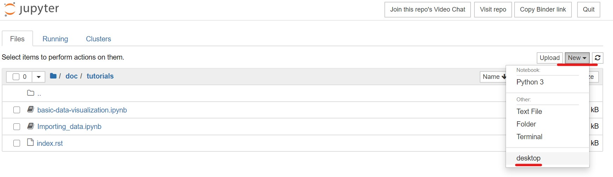
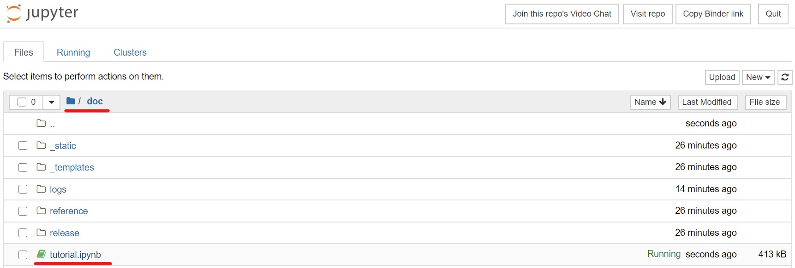

.. _tutorials:

Tutorials
*********

You can try the following tutorials in your web browser using `Binder <https://mybinder.org/>`_.

1. Launch a Binder instance by clicking the following Binder badge. (It may take some time for the instance to start up.)

.. image:: https://mybinder.org/badge_logo.svg
   :target: https://mybinder.org/v2/gh/bdemchak/py4cytoscape/master?filepath=doc%2Ftutorials

2. Launch Linux desktop by clicking the ``New ▼`` button -> ``desktop``.

3. Right click the Linux Desktop and click ``Open Terminal Here``, and run ``bash ~/cytoscape-unix-3.8.0/cytoscape.sh`` (This command launches Cytoscape Desktop).

.. image:: https://raw.githubusercontent.com/nrnb/gsod2019_kozo_nishida/master/images/right_click_start_terminal.png

.. image:: https://raw.githubusercontent.com/nrnb/gsod2019_kozo_nishida/master/images/binder_starting_cytoscape_inXFCE4.jpg

4. Click on the ipynb file for the tutorial you would like to try. 

.. toctree::
   :maxdepth: 2

   basic-data-visualization.ipynb
   Importing_data.ipynb
   