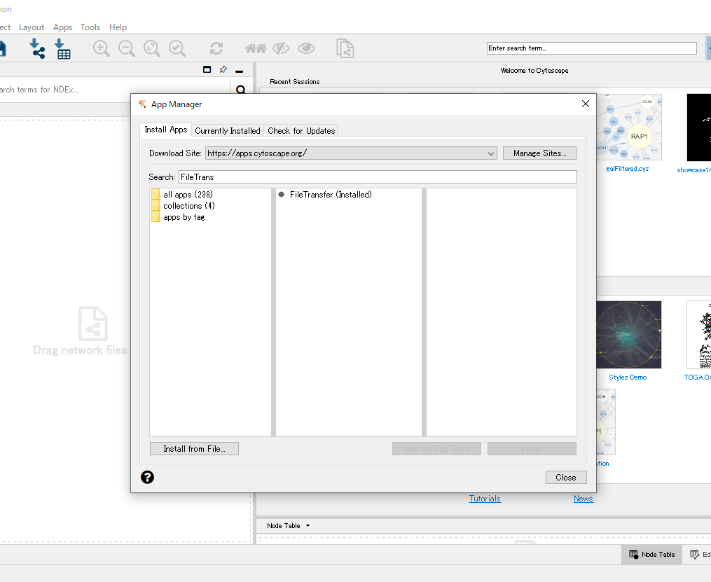

.. _tutorials:

Tutorials
*********

You can try the following tutorials with Cytoscape Desktop + `Google Colab <https://colab.research.google.com/>`_.

1. Install Cytoscape in your local desktop environment and launch it.

2. Install FileTransfer App with Cytoscape App Manager (by clicking the ``Apps`` in the Cytoscape menu bar -> ``App Manager``..)

3. Click on the "Open in Colab" badge in the tutorial below.

.. toctree::
   :maxdepth: 2

   Overview-of-py4cytoscape
   Cytoscape-and-iGraph
   Importing-data
   Identifier-mapping
   Custom-Graphics
   Filtering-Networks
   analyse_coexp_with_mcode
